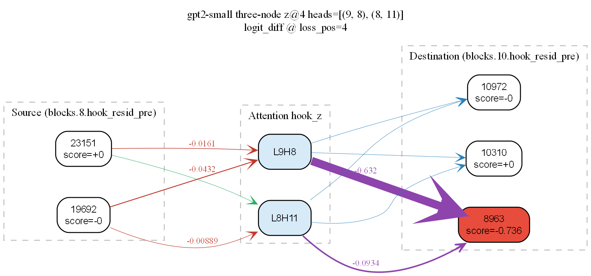
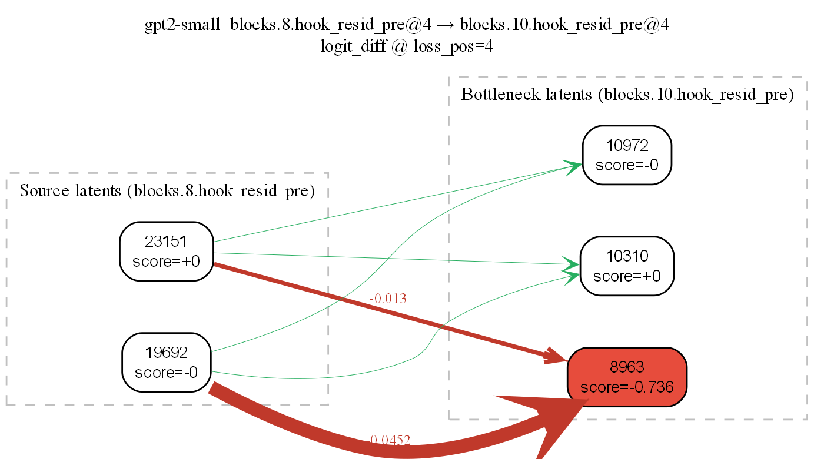
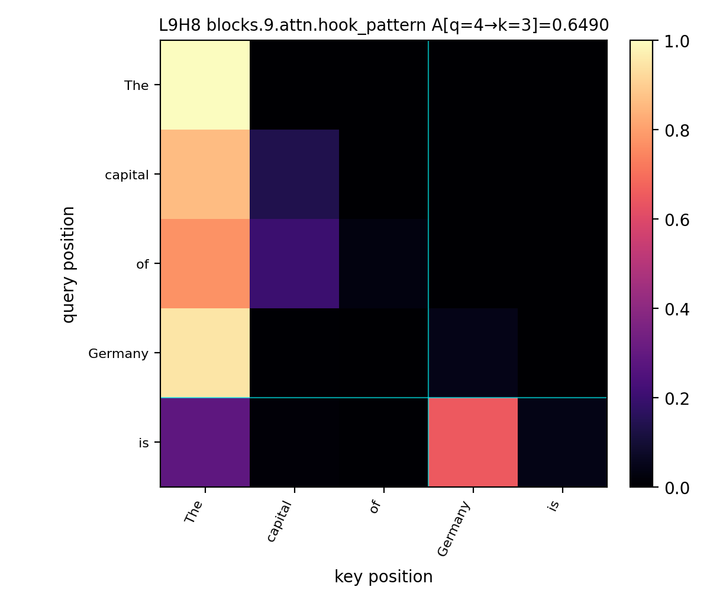

# llm-scalpel

A causal-intervention toolkit for mechanistic interpretability: combine activation patching (clean → corrupt swaps over hooks, heads, positions) with SAE attribution and circuit-graph extraction to find which components actually carry a behavior.



## Finding: factual recall is mediated by an attention-head relay

For `"The capital of Germany is"` on `gpt2-small`, direct `resid_pre → resid_pre` edges between the layer-8 country latents and the layer-10 bottleneck latent are near-zero (the two strongest direct edges are −0.045 and −0.013). Inserting **L9H8** as a middle node closes the circuit: at the prediction position ` is`, L9H8 reads ` Germany` with attention weight **0.649**, and the resulting `L9H8 → 8963` edge in the SAE-attribution graph is **−0.632** — more than an order of magnitude larger than any direct-path edge. Factual recall here is an attention-mediated relay, not a same-position residual hand-off. The [`discovery (experimental)`](#discovery-experimental) section below shows how to reproduce both views.

## How the stack fits

`causal_patcher/` is the patching primitive: `PatchTarget` selects a hook / head / position site, and `ExperimentRunner` (or `BatchExperimentRunner` for left-padded batches) runs a clean / corrupt pair and overwrites the corrupt activation with the clean one. `discovery/` layers SAE attribution, KL-budget pruning, and Graphviz circuit export on top of those primitives. Both packages share the same TransformerLens `HookedTransformer` and hook-name conventions.

**Scope.** Validated on `gpt2-small` with the [`gpt2-small-res-jb`](https://huggingface.co/jbloom/GPT2-Small-SAEs-Reformatted) residual-stream SAEs from SAELens. `discovery/` is experimental and is not yet shipped in the built wheel.

## causal-patcher (Python package)

Install from the repository root:

```bash
pip install -e "."
# Optional: notebook + table deps for examples
pip install -e ".[demo]"
```

### Minimal example

Patch a single attention head (L9H8) from a clean run into a corrupt run and read off the recovery:

```python
from transformer_lens import HookedTransformer
from causal_patcher import ExperimentRunner, PatchTarget

model = HookedTransformer.from_pretrained("gpt2-small")
runner = ExperimentRunner(
    model,
    clean_prompt="The capital of France is",
    corrupt_prompt="The capital of Germany is",
    clean_answer_token=model.to_single_token(" Paris"),
    corrupt_answer_token=model.to_single_token(" Berlin"),
)

patched_logits = runner.patch_clean_into_corrupt(
    PatchTarget(kind="attn_head_z", layer=9, head=8),
)
recovery = runner.logit_diff(patched_logits) - runner.logit_diff(runner.corrupt_logits)
```

For multiple prompts at once (left-padded; `P_clean` and `P_corrupt` may differ):

```python
from causal_patcher import BatchExperimentRunner

batched = BatchExperimentRunner(
    model,
    clean_prompts=["The capital of France is", "The capital of Italy is"],
    corrupt_prompts=["The capital of Germany is", "The capital of Spain is"],
    clean_answers=[" Paris", " Rome"],
    corrupt_answers=[" Berlin", " Madrid"],
)
batched.run_baselines()
patched_logits = batched.patch_clean_into_corrupt(
    PatchTarget(kind="attn_head_z", layer=9, head=8),
)
```

### Interpreting patch heatmaps (logit difference)

`causal_patcher.viz` plots **logit(clean answer) − logit(corrupt answer)** on the patched **corrupt** run. With the default `RdBu_r` scale (centered at zero):

| Color        | Meaning |
|--------------|---------|
| **Red / warm**  | **Recovery** — the patch *increased* that score; the run looks *more* like the clean-answer side of the comparison. |
| **Blue / cool** | **Suppression** — the patch *decreased* the score; the readout moved toward the corrupt answer or away from the clean one. |
| **Near white**  | little effect. |

A longer guide (layer × position vs. layer × head, baselines, caveats) is in [`docs/heatmap.md`](docs/heatmap.md).

### Token labels on the x-axis

`plot_layer_position_patching` labels each column with decoded subwords from the **corrupt** prompt by default. For custom grids, pass `x_tick_labels=viz.position_tick_labels(runner, "corrupt")` to `plot_heatmap`, or `which="clean"` to align the axis with the clean sequence.

## discovery (experimental)

Code under `discovery/` builds on a TransformerLens `HookedTransformer` with **hook-mounted SAE-style** `encode_fn` / `decode_fn` callables. You supply the SAE (or a toy linear stand-in); the library wires **residual-aware reconstruction** at the hook, attribution, and optional KL-budget pruning.

| Module | Role |
|--------|------|
| `discovery.sae_scout` | SAE weight loading/cache helpers, `reconstruct_activation`, `feature_capture` |
| `discovery.attribution` | `feature_act_grad_scores`, `feature_attribution_pass`, integrated gradients, residual-channel score + completeness helpers |
| `discovery.pruner` | `prune_sae_circuit` (τ-KL) and `prune_sae_circuit_budget` (KL budget, optional drift gate, optional IG ranking) |
| `discovery.labels` | Neuronpedia feature labels + JSON cache |
| `discovery.circuit_graphviz` | Bipartite SAE latent graphs (DOT) + cross-hook edge weights (`scripts/sae_crosslayer_circuit_dot.py`) |

### Cross-layer SAE graphs: direct path vs tripartite bridge

The DOT export from `discovery.circuit_graphviz` measures cross-layer influence in two complementary views. On factual recall (`"The capital of Germany is"`):

| Direct bipartite | Tripartite |
| :--- | :--- |
|  |  |
| `resid_pre` → `resid_pre` between two layers at different token positions yields **near-zero edges**, so factual recall is not a same-position residual hand-off. | Inserting **L9H8** as a middle node connects the circuit: layer-8 country latents → mover head (L9H8) → layer-10 bottleneck latent. |

#### Benchmark JSON

Processed benchmark files (for example `benchmarks/processed/factual_recall_filtered_enriched.json`) have a top-level `pairs` array with `clean`, `corrupt`, `correct_answer`, and usually `corrupt_answer`. When **`--benchmark-json`** is set, discovery scripts load **`--benchmark-index`** (default `0`) or **`--benchmark-id`**, and fill prompts / answers from that row (overriding the usual `--clean-prompt`, `--corrupt-prompt`, etc.). Single-prompt tools (`scripts/visualize_attention_heads.py`, `scripts/intervene_layer8_to_layer9.py`) use **`--benchmark-prompt-field`** (`clean` or `corrupt`, default `corrupt`) to choose which string becomes `--prompt`.

#### Workflow
1. **Baseline:** run `scripts/sae_crosslayer_circuit_dot.py` to see where the direct residual path is empty.
2. **Identify:** rank candidate mover heads with `scripts/find_mover_heads.py` (e.g. **L9H8**).
3. **Verify:** plot attention with `scripts/visualize_attention_heads.py` and check the head reads from the subject token (` Germany`) at the query position (` is`).

   

   For `"The capital of Germany is"` on `gpt2-small`, L9H8 at query position 4 (` is`) attends to key position 3 (` Germany`) with weight **0.649** — vs. 0.043 on its own position and ≤0.014 on the structural tokens. That's the "ground truth" the DOT edge in step 4 then rests on.
4. **Map:** re-run the DOT script with `--three-node --middle-head L H` to emit the latent → head → latent graph.

**Imports:** use an editable install from the repo root (`pip install -e "."`) and run with working directory / `PYTHONPATH` including the repo so `import discovery` resolves. The built wheel currently ships **`causal_patcher` only**; `discovery` is not yet listed as an installable package in the wheel.

**Ranking shape:** attribution returns a **dense** score vector of length `n_features` (full SAE width at one sequence position). Large dictionaries (e.g. 128k latents) mean full-length tensors per pass.

## Scripts

- `scripts/benchmark_discovery_cost.py` — rough timing for attribution/IG paths on a tiny `HookedTransformer` + linear SAE stub; optional integrated-gradients and completeness flags.
- `scripts/test_neuronpedia_label.py` — smoke test for label fetch/cache (see `discovery.labels` and your environment/API setup).
- `scripts/sae_crosslayer_circuit_dot.py` — Graphviz DOT bipartite graph between two SAE hooks (optional `--src-seq-pos` / `--dst-seq-pos` / `--loss-seq-pos`).
- `scripts/find_mover_heads.py` — rank attention heads by marginal clean→corrupt `hook_z` patching effects.
- `scripts/visualize_attention_heads.py` — plot `hook_pattern` for nominated heads (PNG export; optional query/key highlight).
- `scripts/intervene_layer8_to_layer9.py` — layer-8 SAE intervention with capture at **`blocks.10.hook_resid_pre`** by default (post–mover-head readout); **`--benchmark-batch`** loops over a benchmark JSON (`pairs`) for Phase 3–style batch runs.

## Benchmarks

Generate **clean / corrupt / correct_answer** pairs for GPT-2–aligned factual-recall experiments (token-length symmetry, then a probability screen).

1. **`benchmarks/generate_benchmark_deepseek.py`** — calls DeepSeek **`deepseek-reasoner`**, asks for JSON arrays only, strips common reasoning/thinking blocks before parsing, and **drops pairs** whose **GPT-2 token length** differs between `clean` and `corrupt`. Put **`DEEPSEEK_API_KEY`** in a **repo-root `.env`** file (or export it); the script loads `.env` via `python-dotenv`.

   ```bash
   python benchmarks/generate_benchmark_deepseek.py --total-pairs 250 --out benchmarks/raw/factual_recall_250.json
   ```

   Use **`--total-pairs`** somewhat above your target if you will filter next (obscure facts often fail the screen). **`--dry-run`** writes a tiny sample without calling the API.

2. **`benchmarks/enrich_benchmark_pairs.py`** (optional; **use this instead of regenerating** if you only need fixes) — **`--spacing-only`** normalizes **`correct_answer`** for GPT-2 continuations (leading space after prompts like `"... is"` with **no** trailing space—e.g. **`" Paris"`**—and no extra space when the prompt already ends with whitespace). Without **`--spacing-only`**, fills **`corrupt_answer`** in **batched** DeepSeek calls (default **`deepseek-chat`**, far fewer requests than full generation). Requires **`DEEPSEEK_API_KEY`** unless spacing-only.

   ```bash
   python benchmarks/enrich_benchmark_pairs.py --input benchmarks/raw/factual_recall_250.json --out benchmarks/raw/factual_recall_250_enriched.json --spacing-only
   python benchmarks/enrich_benchmark_pairs.py --input benchmarks/raw/factual_recall_250.json --out benchmarks/raw/factual_recall_250_enriched.json
   ```

   Use enriched **`correct_answer` / `corrupt_answer`** strings with **`HookedTransformer.to_single_token`** for **`ExperimentRunner`** / **`BatchExperimentRunner`** answer tokens.

3. **`benchmarks/build_benchmark.py`** — loads raw JSON and keeps pairs where, at the **last prompt position**, the softmax probability of the **first token** of `correct_answer` on the **clean** prompt exceeds **`ratio`** times the same probability on the **corrupt** prompt (default **`ratio=2`**, model **`gpt2-small`**).

   ```bash
   python benchmarks/build_benchmark.py --input benchmarks/raw/factual_recall_250.json --out benchmarks/processed/factual_recall_filtered.json
   ```

   The output lists **`pairs`** (kept) and **`dropped_pairs`** with `p_clean`, `p_corrupt`, and drop reasons.

## Tests

```bash
pytest
```

`tests/` currently focus on `causal_patcher` (including viz). Discovery is exercised mainly via scripts and your own notebooks.

## Examples

- **Notebook:** `notebooks/demo_factual_recall.ipynb` — factual recall (Eiffel/Paris vs Colosseum/Rome) on `gpt2-small` with `resid_pre` and `attn_head_z` sweeps.
- **Notebook:** `notebooks/demo_batched_factual_recall.ipynb` — batched / left-padded factual recall using `BatchExperimentRunner`.
- **Heatmap reading:** see [`docs/heatmap.md`](docs/heatmap.md).
